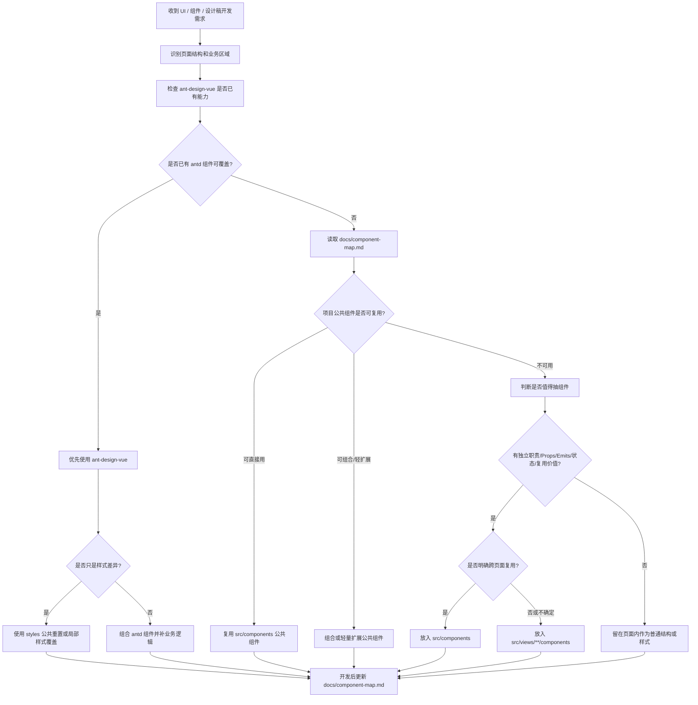

# UI 组件复用图谱流程说明

本文档给维护者查看，安装 skill 的使用者不需要主动阅读。实际执行规则以 `skills/ui-component-reuse/SKILL.md` 为准。

## 总流程



## 设计稿拆组件判断

1. 先拆页面区域，不急着新建组件。
2. 对每个区域先判断 ant-design-vue 是否已有组件。
3. 样式差异优先走 `styles` 公共重置或局部覆盖，不因为圆角、间距、颜色不同而新建组件。
4. 再查 `docs/component-map.md`，优先复用项目公共组件。
5. 只有具备独立职责、清晰数据边界、独立状态或明确复用价值时才抽组件。
6. 可跨页面复用放 `src/components`；当前页面专用或不确定放 `src/views/**/components`。

## 初始建图

老项目第一次接入时，运行：

```bash
node skills/ui-component-reuse/scripts/scan-vue-components.mjs /path/to/project
```

脚本会自动创建 `docs/`；当 `docs/component-map.md` 不存在时自动初始化正式索引，存在时不覆盖。
