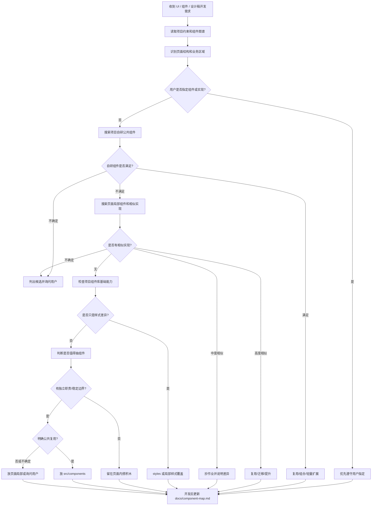

# UI 组件复用图谱

## 概述

用于在 TRS Vue 3 + TypeScript 项目中做 UI 和组件开发前，先判断是否应复用项目自研组件、公共组件、页面局部组件、图表组件或组件库基础能力，避免重复造组件、过度拆分，并在开发后维护 `docs/component-map.md`。

**核心原则**：优先复用项目已有自研组件，组件库只作为底层能力；不确定是否抽组件、放公共还是局部、复用哪个已有组件时，必须问用户；页面先搭积木，只抽有明确职责和稳定边界的组件；公共组件以“拿走就能用”为目标，不要过早拆散强相关代码；图表形态组件可优先公共化，业务图表优先组合公共图表组件。

## 必走流程

1. 如果需求来自设计稿、截图或 UI 描述，先拆页面区域，再决定是否抽组件。
2. 读取项目约束：优先读取 `AGENTS.md`、UI 规范、需求文档规则，确认项目实际组件库和大屏规则；不得默认使用 antd。
3. 读取 `docs/component-map.md`；如果不存在，Agent 必须自动运行扫描脚本，不要要求用户手动执行脚本。脚本会在正式索引不存在时初始化 `docs/component-map.md`。
4. 查询项目已有自研组件是否能直接复用、组合复用、轻量扩展或迁移复用。
5. 查询项目已有相似页面实现，尤其是 `src/views/**/components`、`src/views/**/chartOptions`、`docs/requirements`。
6. 如果已有组件或相似实现能满足，优先使用已有实现；不确定能否满足时，列出候选和不确定点并询问用户。
7. 如果只是圆角、间距、颜色、字号、边框、阴影、表格 padding、弹窗标题等样式差异，优先在项目 `styles` 公共重置或局部样式中覆盖，不新建组件。
8. 只有项目已有组件、相似实现和组件库基础能力都不满足时，才判断是否新建组件。
9. 新组件放置规则：
   - 明确跨页面、跨业务可复用，且 Props / Slots 稳定：放 `src/components`。
   - 当前页面专用或暂时不确定复用价值：放 `src/views/**/components`。
   - 只是布局 class 包裹或静态样式片段：留在页面内，不抽组件。
10. 开发完成后或提交前，必须重新运行组件扫描脚本，对比当前项目组件图谱和既有 `docs/component-map.md`；如发现新增组件、删除组件、引用文件数变化、模板使用次数变化、用途变化或公共化建议变化，必须同步更新正式索引，或在回复中明确说明未更新原因。

## 组件复用优先级

按以下顺序判断，不要跳级自行新写：

1. 用户明确指定的组件或实现方式。
2. 项目已有自研公共组件：`src/components/**/*.vue`。
3. 项目已有公共图表组件：`src/components/**/charts/**/*.vue`、`src/components/charts/**/*.vue`。
4. 项目已有页面局部组件：`src/views/**/components/**/*.vue`。
5. 项目已有相似实现：chart option、composable、mock、样式、需求文档。
6. 项目实际使用的组件库基础组件，例如 Naive UI / ant-design-vue，按项目约束选择。
7. 新建页面局部组件。
8. 新建公共组件。

当项目已有自研组件能满足需求时，优先使用自研组件，不要自行改用组件库基础组件或重新实现。

## 不确定时确认规则

当 Agent 无法明确判断以下事项时，必须向用户确认，不得自行过度拆分或自行替换方案：

- 该视觉块是否应该抽成组件。
- 新组件应放公共目录还是页面局部目录。
- 已有多个候选组件时应该复用哪一个。
- 相似图表应复制、提升为公共组件，还是只参考实现。
- 组件 Props / Slots 边界是否会过度参数化。

确认时输出：候选组件/实现路径、能满足的部分、不确定点、建议选择。若判断明确，则直接执行，不需要为了形式确认。

## 设计稿文字与组件命名规则

- 设计稿中文字识别不确定时，不得直接作为组件名或业务结论；应标记为“待确认”或沿用用户提供的名称。
- 组件命名优先级：
  1. 用户明确给出的业务名称；
  2. `docs/requirements` 中已有名称；
  3. 现有路由、组件、Mock、接口字段中的稳定命名；
  4. 设计稿可清晰识别的文字；
  5. Agent 推断名称。
- 如果设计稿文字和用户纠正不一致，以用户纠正为准，并在后续方案中改名。

## 设计稿拆组件逻辑

先按页面结构识别区域，不要直接按视觉块新建组件。对每个区域按以下顺序判断：

| 判断项 | 处理方式 |
| --- | --- |
| 用户是否指定组件/命名/实现方式 | 优先遵守用户指定 |
| 项目是否已有自研组件 | 优先复用、组合、轻量扩展或迁移 |
| 项目是否有相似页面实现 | 优先抄作业，复用视觉参数和交互结构 |
| 组件库是否已有基础能力 | 按项目实际组件库组合使用 |
| 是否只是样式不同 | 使用 `styles` 公共重置或局部样式覆盖 |
| 是否有独立职责 | 能用一句话说清职责才考虑抽组件 |
| 是否有清晰 Props / Emits / Slots | 有明确输入输出更适合抽组件 |
| 是否有独立状态 | 如 loading、empty、error、selected、expanded、active、disabled、editing |
| 是否跨页面可复用 | 是则放 `src/components`，否则放 `src/views/**/components` |

## 相似实现复用规则

做设计稿拆分时，不能只检查 `src/components`，还必须检查当前项目已有页面中是否存在视觉或业务形态相似的实现。

尤其是以下内容，必须先搜索已有代码再新写：

- ECharts 图表组件和 option：`src/components/**`、`src/views/**/chartOptions/**`、`src/views/**/components/**Chart.vue`。
- 地图、列表、卡片、状态标签、筛选器、时间选择器。
- 已有需求文档中的同类模块说明。

处理方式：

| 相似度 | 处理 |
| --- | --- |
| 80% 以上相似 | 优先复用已有组件；如果只是局部组件，可迁移或提升为公共组件 |
| 50%~80% 相似 | 参考已有实现“抄作业”，保持视觉参数、交互结构和命名口径一致 |
| 低于 50% | 可新建，但要说明为什么不能复用 |

## 图表组件规则

图表不只判断“是否使用 ECharts”，还要判断是否已有可复用的图表形态组件或相似图表实现。

### 图表公共化判断

图表本身通常是展示形态，不一定绑定业务。满足以下条件时，优先考虑放入公共图表组件：

- 不绑定具体接口字段。
- 不绑定具体业务标题。
- 只接收 `categories`、`series`、`data`、`unit`、`legend`、`colors` 等通用参数。
- 内部负责 ECharts option 和统一视觉风格。
- 复制到其它页面后可直接使用。

适合公共化的示例：普通柱状图、堆叠柱状图、渐变折线图、面积折线图、各县趋势折线图、环形图、排名柱状图。

以下情况先放页面局部组件：

- 强绑定具体业务字段、接口或状态联动。
- 地图上叠加特定业务弹窗、点位或全页面联动。
- tooltip、legend、series 名称写死业务含义且难以参数化。
- 只是当前页面一次性特殊图形。

### option 放置规则

公共图表组件优先把 option 内聚在组件内部，业务组件通过 Props 传数据，做到“拿组件就能用”。不要默认把 option 拆到 `chartOptions/` 导致复用时必须同时搬多个文件。

推荐顺序：

1. 首次实现：完整图表组件内聚 option。
2. 二次复用：复制或提升完整图表组件。
3. 多处复用且差异可参数化：抽公共图表组件。
4. 多个图表组件共享复杂 option 生成逻辑，或需要单测时：再抽 option factory。

只有满足以下条件之一，才单独抽 `chartOptions/*.ts` 或 option factory：

- 同一套 option 已被两个及以上图表复用。
- option 生成逻辑复杂，需要单测。
- 图表组件文件过大，影响维护。
- 已有页面存在高度相似的 option，需要复用或轻量改造。
- 用户明确要求分离配置。

图表类组件分析输出必须说明：是否复用公共图表组件、是否参考已有图表实现、是否需要提升公共组件、option 放在哪里以及原因。

## 视觉壳组件公共化规则

“只是静态布局片段不要公共化”不等于所有无业务逻辑的组件都不能公共化。

以下情况可以公共化：

- 是多个页面可能复用的稳定视觉壳，例如大屏标题栏、分组标题、科技边框、卡片装饰、角标、序号徽章。
- Props 很少且稳定，例如 `title`、`variant`、`size`。
- 主要通过 slot 承载业务内容，不需要传入大量页面内部变量。
- 统一视觉风格的收益明显，高于组件抽象成本。

以下情况不要公共化：

- 只为了少写几行 HTML。
- 只能服务当前页面具体业务。
- 抽出来后需要传大量字段和状态。

## 外层聚合组件判断

不要为了目录看起来整齐而抽外层组件。

如果一个组件只做以下事情，默认不要抽：

- 仅包裹多个子组件。
- 只写布局 class。
- 没有独立业务职责。
- 没有独立状态、数据转换、事件协调。
- 不会被单独复用或单独测试。

推荐做法：页面级布局直接写在 `index.vue`；抽真正有职责的业务面板；当外层组件开始承担独立状态、折叠展开、数据编排、跨子组件联动时，再抽。

## 决策流程图



维护者可查看仓库文档 `docs/ui-component-reuse-flow.md`，该文档用于后期回顾，不要求安装者阅读。

## 自动触发时机

以下场景必须自动检查并生成组件图谱，不需要用户手动运行脚本：

- 用户拿一个老工程要求做 UI、页面、组件、设计稿拆分或组件复用分析。
- 用户明确提到“公共组件索引”“组件图谱”“先看看有没有公共组件”。
- 开发前需要判断 `src/components` 是否已有组件可复用，但业务项目没有 `docs/component-map.md`。

Agent 执行顺序：

1. 检查业务项目根目录是否存在 `docs/component-map.md`。
2. 不存在时，自动运行：

```bash
node <skill-dir>/scripts/scan-vue-components.mjs <project-root>
```

3. 脚本自动创建 `docs/`，并初始化 `docs/component-map.md`。
4. 生成的组件表格必须按 `引用文件数` 倒序排列；引用文件数相同时按 `模板使用次数` 倒序排列，再按路径升序排列，方便优先查看跨文件复用组件。
5. 检查 `用途` 列：如果出现“用途需结合源码确认”、明显过泛或无法支撑复用判断，Agent 必须读取对应组件源码后补齐，不得要求用户手动填写。
6. 继续基于 `docs/component-map.md` 做组件复用判断。
7. 如果 `docs/component-map.md` 已存在，不覆盖；但开发完成后或提交前必须重新运行扫描脚本做对比扫描，不能静默跳过已有文件。

## 组件索引规则

正式索引固定放在业务项目：

```text
docs/component-map.md
```

如果该文件不存在，Agent 在使用本 skill 处理老工程、UI 开发或组件开发需求时，必须自动运行本 skill 的扫描脚本；不要让用户手动创建 `docs/` 或手动执行脚本。脚本会自动创建 `docs/`，并在正式索引不存在时初始化 `docs/component-map.md`：

```bash
node <skill-dir>/scripts/scan-vue-components.mjs /path/to/project
```

默认生成或对比扫描：

```text
docs/component-map.md（仅当原文件不存在时创建；已存在时不覆盖，但输出对比扫描结果；如需强制重建可用 `--force`）
```

扫描范围只包括：

```text
src/components/**/*.vue
src/views/**/components/**/*.vue
```

不要覆盖已有正式索引；如果 `docs/component-map.md` 已存在，脚本默认不改文件，但必须输出对比扫描结果，正式索引由 Agent 根据差异在开发后或提交前维护。

生成或维护索引表格时，`公共组件` 和 `页面局部组件` 两个表格都必须按 `引用文件数` 倒序排列；引用文件数相同时按 `模板使用次数` 倒序排列，再按组件路径升序排列，避免跨文件高复用组件被单文件高频组件淹没。

### 引用指标口径

组件图谱不再使用含糊的“引用次数”作为主字段。

| 字段 | 含义 | 主要用途 |
| --- | --- | --- |
| `引用文件数` | 有多少个文件引用或使用该组件 | 判断复用范围、跨页面/跨模块程度、是否适合公共化 |
| `模板使用次数` | 组件标签在模板中出现的总次数 | 判断页面内使用密度、性能优化价值、是否需要更高阶组合组件 |
| `引用位置` | 具体引用或使用文件 | 判断是否真的跨业务，而不是同一模块内部重复使用 |

公共化建议必须优先看 `引用文件数`。例如同一文件内使用 20 次，只能说明当前页面密集使用；多个文件各使用 1 次，更能说明跨页面复用价值。`模板使用次数` 有意义，但只能作为辅助判断，不得单独作为公共化主依据。

### 开发后对比扫描规则

开发完成后或提交前，Agent 必须重新运行：

```bash
node <skill-dir>/scripts/scan-vue-components.mjs /path/to/project
```

如果 `docs/component-map.md` 已存在，脚本不会覆盖正式索引，但必须输出对比扫描结果。Agent 必须根据结果处理以下事项：

- 新增组件：补入正式索引。
- 删除组件：从正式索引移除或标记已删除。
- 引用文件数变化：同步更新排序、引用位置和公共化判断。
- 模板使用次数变化：同步更新使用密度信息。
- 用途变化候选：读取源码确认后修正 `用途`。
- 新增公共组件候选或公共化建议变化：更新“是否建议公共化”列并说明原因。
- 新增/复用/改造记录：确认“设计稿拆组件记录”已写入本次决策。

不能因为正式索引已存在就跳过扫描；如果未更新 `docs/component-map.md`，必须在回复中明确说明未更新原因。

### `用途` 列维护规则

`用途` 是 Agent 后续判断能否复用组件的核心字段，不是留给用户手写的备注列。

- 扫描脚本必须尽量根据组件注释、组件名、路径、Props 和所属 view 自动生成基础用途，不要大面积写 `待补充`。
- 如果脚本只能生成类似“用途需结合源码确认”的保守描述，Agent 在首次使用该组件图谱做 UI / 组件决策时，必须读取对应 `.vue` 源码并补齐为一句明确用途。
- `用途` 控制在一句话内，优先包含可搜索关键词，例如：筛选查询、表单、弹窗、表格、列表、卡片、标题、状态标签、趋势折线图、柱状图、地图、指标数据、大屏边框。
- 不确定业务含义时可以写 UI 类型和待确认边界，例如“用户管理页面筛选查询组件（业务字段待确认）”，但不能把维护责任转给用户。
- 开发后新增、改造、复用或迁移组件时，Agent 必须同步更新 `用途`，并修正初始化阶段的粗略推断。

## 推荐索引格式

组件表格按 `引用文件数` 倒序排列；引用文件数相同时按 `模板使用次数` 倒序排列，再按路径升序排列。

```md
# 组件图谱索引

## 公共组件

| 组件 | 路径 | 用途 | Props | Emits | 引用文件数 | 模板使用次数 | 引用位置 | 备注 |
| --- | --- | --- | --- | --- | --- | --- | --- | --- |

## 页面局部组件

| 组件 | 路径 | 所属页面 | 用途 | Props | Emits | 引用文件数 | 模板使用次数 | 引用位置 | 是否建议公共化 |
| --- | --- | --- | --- | --- | --- | --- | --- | --- | --- |

## 设计稿拆组件记录

| 页面/需求 | 拆分结果 | 复用组件 | 新增组件 | 决策说明 |
| --- | --- | --- | --- | --- |
```

## 页面局部组件公共化触发点

Agent 在以下场景必须主动评估 `src/views/**/components` 下的页面局部组件是否应提升为公共组件：

1. 读取或生成 `docs/component-map.md` 时，发现某个页面局部组件被两个及以上文件或页面引用。
2. 页面局部组件 `引用文件数` 达到 2 个及以上，或 `模板使用次数` 达到 3 次及以上且不是同一页面内部的简单重复渲染。
3. 当前开发需求需要复用、修改、复制或参考某个页面局部组件。
4. 用户要求做老项目组件梳理、公共组件治理、组件图谱维护、重复组件分析或“看看有没有组件该抽公共”。
5. Agent 准备新建一个与现有页面局部组件相似度 80% 以上的组件。

触发评估后，不得只因为“模板使用次数多”就直接迁移；公共化判断以 `引用文件数` 为主，以 `模板使用次数` 为辅，必须先判断：

- 是否跨页面、跨业务使用，而不是只在同一页面内多次出现。
- 是否强绑定当前页面接口字段、业务流程、路由参数、权限逻辑或页面状态。
- Props / Emits / Slots 是否清晰稳定。
- 是否可以做到移动到 `src/components` 后“拿走就能用”。
- 是否会导致大量调用方破坏性改造或引入隐性行为变化。
- 是否只是布局壳、样式微调或组件库二次封装。

评估结果分三类处理：

| 结果 | 处理 |
| --- | --- |
| 明确适合公共化 | 当前任务涉及该组件时，可迁移到 `src/components`，同步更新引用和 `docs/component-map.md` |
| 可能适合但业务边界不确定 | 输出候选路径、引用情况、可复用部分、不确定点和建议选择，询问用户是否提升 |
| 不适合公共化 | 保持页面局部组件，并在 `docs/component-map.md` 的“是否建议公共化”列说明原因 |

## 老项目公共化治理边界

发现高频页面局部组件时，Agent 应主动提出公共化建议，但不要在与当前需求无关时擅自进行大范围迁移。

只有满足以下任一条件，才可以执行迁移：

- 用户明确要求整理、公共化、迁移或重构该组件。
- 当前开发任务正在修改、复用、复制或新增相似组件。
- 不迁移会导致继续复制粘贴或新增重复组件。
- 迁移范围可控，且能通过现有检查确认不改变原有业务行为。

否则只在回复和 `docs/component-map.md` 中标记“建议公共化”，说明引用情况、建议原因和暂不迁移的边界。

## 公共化判断

满足任一条件时，考虑放入或提升到 `src/components`：

- 已经被两个及以上页面使用。
- 是稳定的基础能力、业务无关 UI 能力或通用图表形态。
- 是稳定视觉壳，Props 少且主要通过 slot 承载内容。
- 有清晰、稳定的 Props / Emits / Slots。
- 封装的是重复交互逻辑，而不是单纯页面内布局。
- 未来多个页面大概率会复用。

以下情况不要公共化：

- 只服务当前页面。
- 强依赖当前页面接口字段、状态或业务流程。
- 只是组件库的样式微调。
- 只是外层布局包裹或为了目录整齐。
- 抽出来后 Props 需要传入大量页面内部变量。

## 常见误区

| 误区 | 正确做法 |
| --- | --- |
| 看到设计稿一块区域就抽组件 | 先判断职责、数据边界、状态和复用价值 |
| 项目已有组件能用还新写 | 优先复用项目自研组件；不确定就问用户 |
| 默认先用 antd 或其它组件库 | 先遵守项目实际技术栈和自研组件，组件库只是底层能力 |
| 图表只说“用 EChartsCom” | 还要判断是否已有公共图表组件、相似图表实现和 option 放置方式 |
| 把 option 默认拆到 chartOptions | 公共图表组件优先内聚 option，必要时再抽 option factory |
| 为了目录整齐抽左右栏/外层容器 | 纯布局聚合留在页面 `index.vue` 搭积木 |
| 无业务逻辑就一定不公共化 | 稳定视觉壳、通用图表形态可以公共化 |
| 公共组件越多越好 | 公共组件需要稳定边界；不确定先问用户或放局部 |
| 只新增组件不更新索引 | 开发后或提交前必须重新扫描并更新 `docs/component-map.md`，或明确说明未更新原因 |
| 老项目没有索引就跳过复用检查 | 先运行扫描脚本生成初始图谱；已有索引也要在开发后跑对比扫描 |
| 初始化索引里 `用途` 都是 `待补充` | 脚本先自动推断；仍不明确时 Agent 读源码补齐，不让用户手写 |
| OCR 文字直接当组件名 | 文字不确定要标记或询问，优先用户/需求文档/现有命名 |

## 与其他 TRS skills 的关系

- 规划或设计 Vue 组件职责、Props、Emits 时，同时使用 `vue-component-design`。
- 涉及样式覆盖、响应式、Less/UnoCSS、z-index 时，同时使用 `css-patterns`。
- 涉及表单、筛选区、弹窗表单时，同时使用 `form-validation`。
- TRS 开发计划涉及 UI 或组件任务时，应在计划中列出本 skill，并明确 `docs/component-map.md` 的读取和更新步骤。
